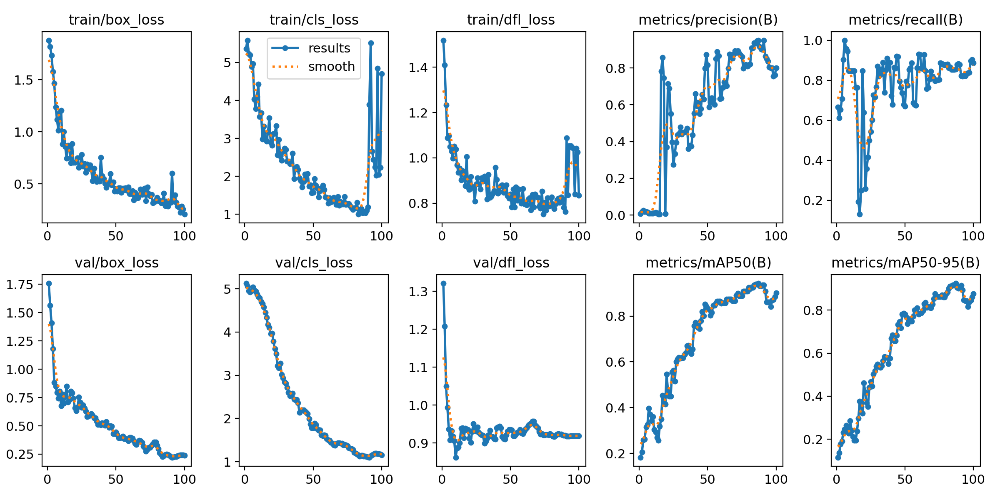
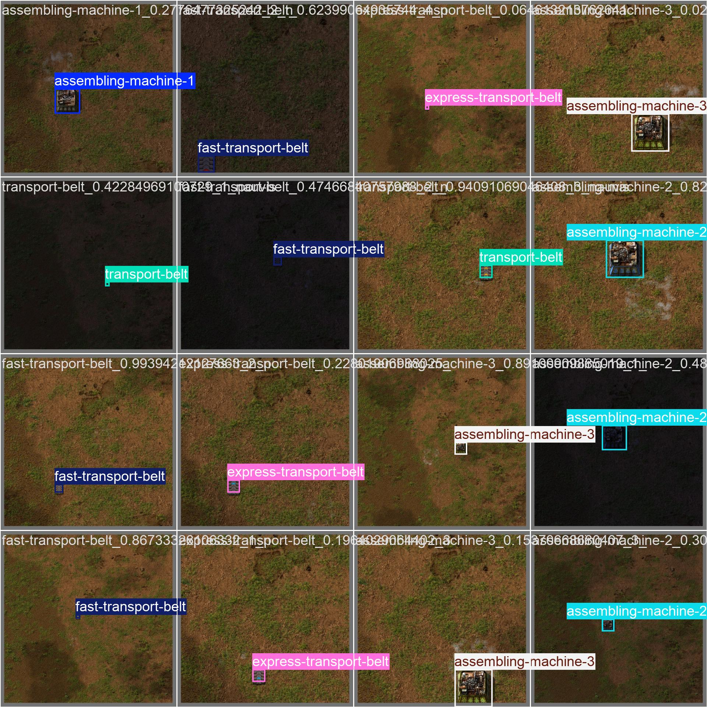
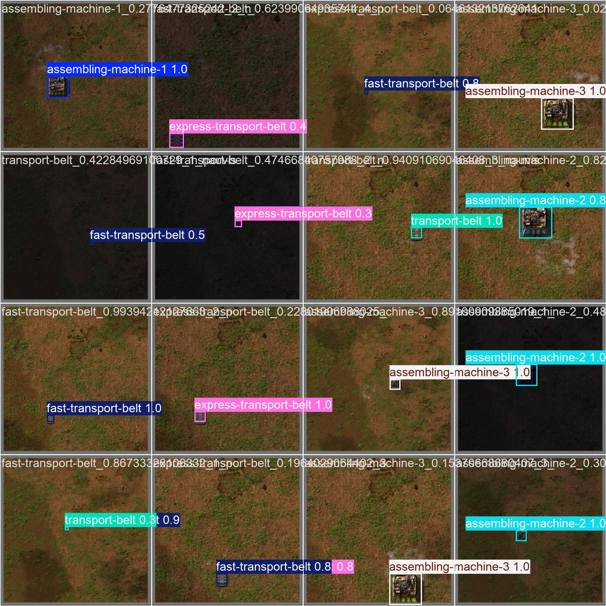

# Factorio YOLO v0


A model for detecting items in Factorio based on YOLOv11n. It can detect 6 items, see [names](./dataset/detect.yaml).

Model repo: https://huggingface.co/proj-airi/factorio-yolo-v0

Dataset repo: https://huggingface.co/datasets/proj-airi/factorio-yolo-dataset-v0

Playground is hosted on [HuggingFace](https://huggingface.co/spaces/proj-airi/factorio-yolo-v0-playground).

Playground repo: https://github.com/proj-airi/game-playing-ai-playground-2d

Available formats:
- ONNX
- PyTorch

## Results



Validation batch 0 labels and predictions:

<div style="display: flex; width: 100%; justify-content: center; gap: 1rem;">
  
  
</div>

## Dataset

The dataset is a collection of images of items in Factorio, [collector code here](../../packages/factorio-rcon-snippets-for-node/src/factorio_yolo_dataset_collector_v0.ts).

It contains 20 images for each item, 17 for training and 2 for validation and 1 for testing.


## Training

Clone datasets:

```bash
git clone https://huggingface.co/datasets/proj-airi/factorio-yolo-dataset-v0
```

Clone training repo:

```bash
git clone https://github.com/moeru-ai/airi-factorio
```

Move dataset to the training repo:

```bash
mv factorio-yolo-dataset-v0 airi-factorio/models/factorio-yolo-v0/dataset/
```

Train the model:

```bash
cd airi-factorio
pixi train
```

## Inference

```bash
cd airi-factorio
pixi predict
```

## Release Workflow

### Model update (new model version)

When a new model is ready, move/copy these files into the model repo before publishing:

- `results/weights/best.pt` -> `best.pt`
- `results/weights/best.onnx` -> `best.onnx`
- `notebooks/notebook.ipynb` -> `notebook.ipynb`
- `results/results.png` -> `results.png`
- `results/val_batch0_pred.jpg` -> `val_batch0_pred.jpg`

```bash
./scripts/move-model-files.sh <model-repo-path>
```

Then publish and tag:

```bash
# model repo
hf upload proj-airi/factorio-yolo-v0 . . --repo-type model --commit-message "<message>"
git pull --ff-only
git fetch --tags
```

If model updated, create tag by the following command:

```bash
hf repo tag create proj-airi/factorio-yolo-v0 <version>
```

Notes:

- Keep `README.md` updated for each release.
- Pin consumers to a fixed `revision` (tag or commit), not `main`.
- Ensure this local repo `origin` points to `proj-airi/factorio-yolo-v0` on Hugging Face Hub.
- After model release, update model list in `https://github.com/proj-airi/game-playing-ai-playground-2d`.

### Dataset update

When dataset content changes, publish the dataset repo and tag it:

```bash
# dataset repo
hf upload proj-airi/factorio-yolo-dataset-v0 . . --repo-type dataset --commit-message "release: <version>"
git pull --ff-only
git fetch --tags
```

Also if model updated, create tag by the following command:

```bash
hf repo tag create proj-airi/factorio-yolo-dataset-v0 <version> --repo-type dataset
```

Notes:

- Keep model and dataset versions aligned when labels change.
- Treat label-definition changes as incompatible changes.
